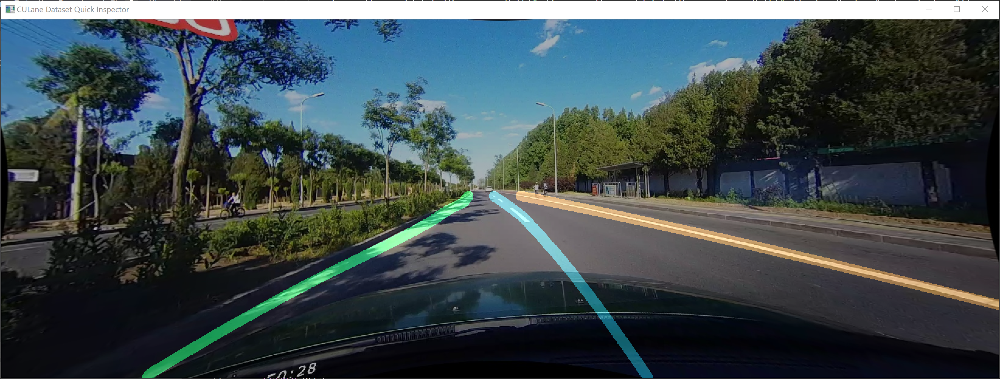
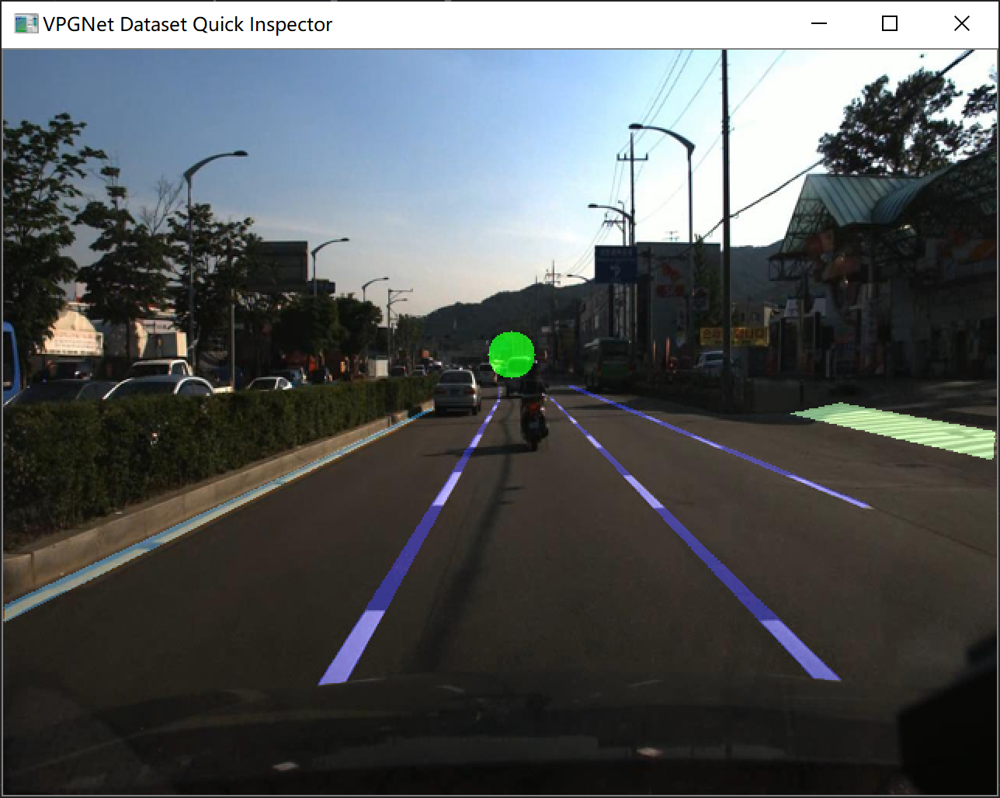
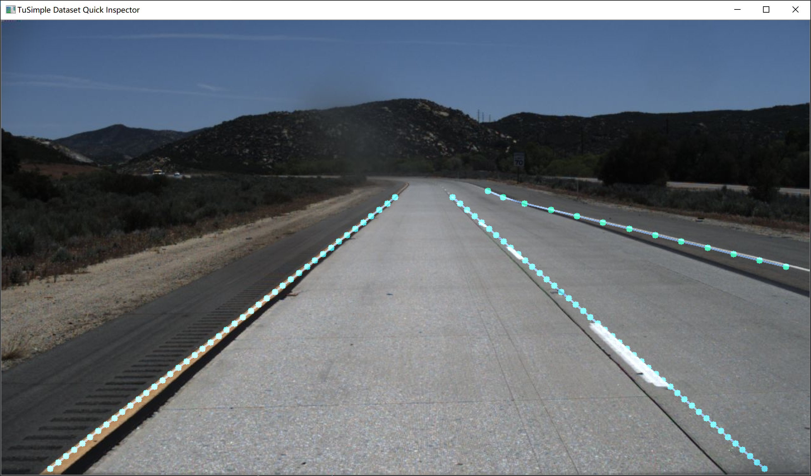

# LaneDatasetInspector
There are some simple python code for walking through the popular lane detection dataset. The usage is pretty simple:

```
python CULaneDbInspector.py --rootDir DATA_SET_DIR
python TuSimpleDbInspector.py --rootDir DATA_SET_DIR 
python VPGNetDbInspector.py --rootDir DATA_SET_DIR
```





PS: BDD100kDbInspector.py is under construction.

Following python lib should be installed:

scipy

numpy

cv2

tqdm


